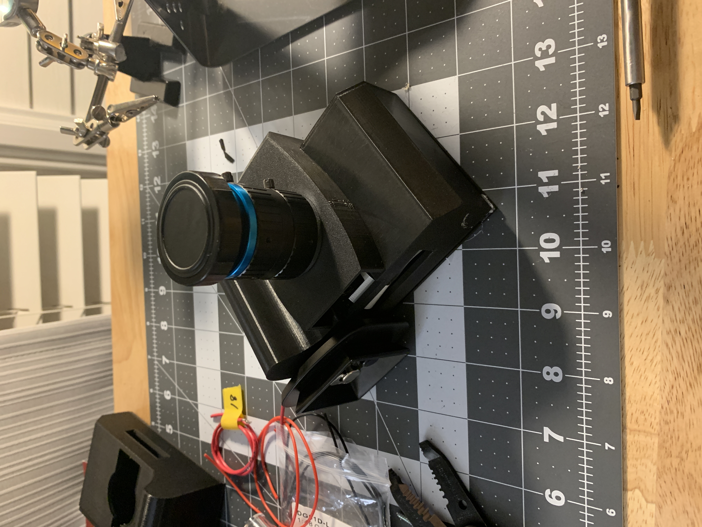

# Raspberry Pi Handheld Touchscreen Camera with Touchscreen and HQ Camera Module

Project Team Members:
David Nguyen, Saniya Datir, Dominik Fill


## Project Overview

This project combines the Raspberry Pi HQ camera module with an Adafruit 2.8" PiTFT LCD touchscreen, combination pushbutton rotary encoder, and a Raspberry Pi 4B to create a retro-style digital handheld camera.

This camera has a shutter button to take pictures, a rotary encoder to control timelapse settings, and a GUI that can be used to switch between pages, whether it'd to display images taken with the camera, or to display live view from the camera.  The 3D-printed housing still allows access to the HQ camera module's tripod mount and for retro vibes.


## Hardware Setup

### What you'll need:

- Raspberry Pi 4B (or any Raspberry Pi platform capable of running 64-bit Raspian)

- [Raspberry Pi High Quality HQ Camera - 12MP](https://www.adafruit.com/product/4561)
(any C-mount lens is compatible with the HQ camera module. Adjustable backfocus on the module allows for most lenses to work with a given adapter to C-mount)

- [16mm 10MP Telephoto Lens for Raspberry Pi HQ Camera - 10MP](https://www.adafruit.com/product/4562)

- [Adafruit PiTFT - 320x240 2.8" TFT+Touchscreen for Raspberry Pi](https://www.adafruit.com/product/1601)

- KY-040 Rotary Encoder Module

- Wires for connecting the rotary encoder to the Pi's GPIO

## LCD

This project will be using the Adafruit PiTFT 2.8" resistive touchscreen as our display and input method. This screen was chosen mainly for convenience as its form factor and driver support allow for easy installation; however, any generic SPI LCD display can also work with a little tinkering. It will be explained more in depth later, but we'll be mirroring the Pi's HDMI output to the display using the fbcp utility rather than having the display act as a raw framebuffer device, also for convenience.


### Wiring
The LCD sits neatly on top of the Pi occupying the first 26 pins of the Pi's header, leaving a few pins open for us to use as GPIO inputs. Attach the camera and LCD like the picture below; the LCD should connect to pins 1 through 26 on the raspberry pi, which include the SPI pins that the LCD uses.


We'll wire the rotary encoder to some of the Pi's GPIO pins. Two pins for the rotary encoder, CLK and DT, and one pin for the pushbutton, SW. The encoder module will need 3-5V power as well. In this case since the LCD occupies all of the Pi's VCC pins, we'll have to tie into the 26-pin socket on the LCD intended for the optional ribbon cable. 

|Raspberry Pi|Encoder|
|---|---|
|GPIO20|CLK|
|GPIO21|DT|
|GPIO16|SW|
|5V|VCC|
|GND|GND|

## Software Setup
This project will be done with Qt5 using QML and C++. The more conventional approach would be to set up a cross compiler and tool-chain to develop and compile in qtCreator on your local Linux machine. After a lot of trial and error though, we weren't able to sucessfully do that, so instead, we'll be developing with Qt Creator straight on the Pi. It's not the fastest or most reliable solution, but it's simple and will work just enough for our case. Keep in mind only B-variants and the Zero W 2 can run 64-bit Raspian, so if you do not have a Pi B, then a Linux cross compiler will be your only option. 

Here are some links to cross-compilation tutorials if that's what you have in mind:
[Cross Compile Qt 6 for Raspberry Pi](https://wiki.qt.io/Cross-Compile_Qt_6_for_Raspberry_Pi)
[Cross Compiling Qt for Raspberry Pi 4](https://github.com/UvinduW/Cross-Compiling-Qt-for-Raspberry-Pi-4)
[Cross compilation of Qt6.3.0 on Raspberry pi 4](https://github.com/PhysicsX/QTonRaspberryPi)


First we'll need a 64-bit image of Raspian OS on our Pi. The setup process is fairly standard, and the Pi Foundation has a great application to help us out.
Install [Raspberry Pi Imager](https://www.raspberrypi.com/software/) on your computer, start it up, and select your boot drive. Then select your desired operating system (Raspberry Pi OS 64-bit Bullseye, the latest release at this time) and hit write. After that, plug your boot drive into the Pi and continue with the set up process. If you're developing headless, then it helps to set up SSH and WiFi settings in the Raspberry Pi Imager before writing to the drive (the gear icon bottom right). 

Once we're through to the desktop, fire up the terminal, and we'll start downloading the dependencies needed for running Qt Creator with Qt5.

```
sudo apt-get update
sudo apt-get upgrade
```
```
$ sudo apt-get install qtbase5-dev qtchooser
$ sudo apt-get install qt5-qmake qtbase5-dev-tools
$ sudo apt-get install qtcreator
$ sudo apt-get install qtdeclarative5-dev
```
Libraries for Qt5 Multimedia and Qt5 folderlistmodel 
```
sudo apt-get install libqt5multimedia5-plugins qml-module-qtmultimedia
sudo apt-get install qml-module-qt-labs-folderlistmodel
```
Of course, a reboot would be best.
```
sudo reboot
```
Now you should be able to open Qt Creator in the programming applications in the start menu. 

When it comes time to build and run a project, it may be necessary change a few options to allow the program to run with root privilages, especially if your project is using the pigpio library since it needs root to intialize (unlike the depreciated WiringPi library replacedby pigpio). 
```
Tools-> Options-> Environment -> Terminal
Set -e sudo after /usr/bin/xterm
```
Also configure to run in terminal. In Run settings (left-side menu) check the box 'Run in Terminal'.


When it comes time to install the LCD, Adafruit provides a detailed guide to installing drivers for their LCD's. You should save this step after finishing your project as their easy installer changes the resolution of the HDMI-out to 640x480 if you go the fbcp route. Of course, you can change the resolution back to whatever you desire and the LCD screen will downscale the image to fit automatically. For legibility of text and fonts, it's best to change the resolution back to something closer to the LCD after you're done developing. In this case, the Adafruit 2.8" PiTFT has a resolution of 320x240. Setting the HDMI resolution to 640x480 causes the image to downscale with a factor of 2 for the LCD. 

Adafruit's Easy Installer provides three options for configuring the LCD: console mode, HDMI mirror mode, and raw framebuffer mode. Console mode outputs only text to the LCD and no touchscreen functionality. Mirror mode will mirror the HDMI output onto the LCD using fbcp, a framebuffer utility. Raw framebuffer mode will only display through code (i.e. you have to write a program and send it manually to the LCD), leaving the HDMI output untouched. This project will use the HDMI mirror mode for simplicity at the expense of some efficiency.

To get started, we'll need some dependencies and Adafruit's driver.
```
cd ~
sudo apt-get update
sudo apt-get install -y git python3-pip
sudo pip3 install --upgrade adafruit-python-shell click
git clone https://github.com/adafruit/Raspberry-Pi-Installer-Scripts.git
cd Raspberry-Pi-Installer-Scripts
```
Next we'll run their Easy Installer with flags corrosponding to our device (2.8" resistive touchscreen in fbcp mode).
```
sudo python3 adafruit-pitft.py --display=28r --rotation=90 --install-type=console
```
It'll ask for a reboot, and afterwards, you'll see output on the LCD.

Resolution settings can be changed in /boot/config.txt
```
sudo nano /boot/config.txt
```

See the full installation instructions for [the LCD](https://learn.adafruit.com/adafruit-pitft-28-inch-resistive-touchscreen-display-raspberry-pi?view=all) for more details and configuration options.


## Assembly
Our assembly goes into our 3D-printed camera body. Obviously this design still needs some tweaking, but will be sufficient for testing out the program and hardware elements.



## Results

Say what we achieved, and show videos and maybe pictures.

## Future work

The most lacking significant improvement is the use of a rechargeable battery instead of a power supply.  Future work for visual content capabilities includes video capture and playback, and a photo burst capability.  Lastly, the GUI could be further developed to edit images stored in memory.

## References

[Project that interfaces GPIO with QML](https://github.com/vigasan/RpiGpio)

[Project that intefaces the camera with C++ and QML](https://github.com/vigasan/CameraRpi)

## List of similar projects

[Ruha Camera](https://github.com/penk/ruha.camera)

[Vintage Raspberry Pi Camera](https://www.instructables.com/Vintage-Raspberry-Pi-Camera/)

[Raspberry Pi Makes Your Retro Analogue Camera Digital](https://www.raspberrypi.com/news/raspberry-pi-makes-your-retro-analogue-camera-digital/)
